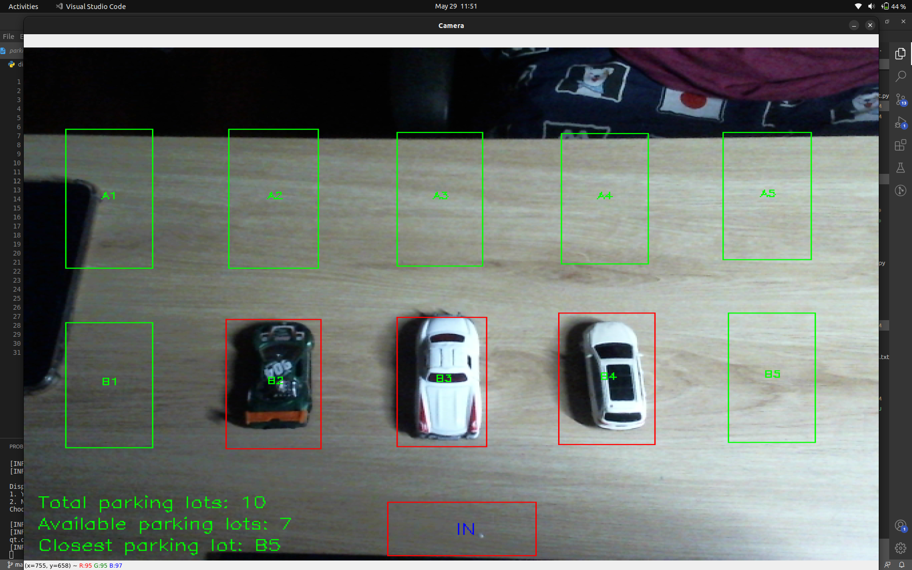

# Smart-Parking-System
A program to check for parking lot's availability (displays total and available parking lot) and calculate the closest parking lot from the entrance (display parking lot's label).

This project aims to benefit outdoor parking lots, helps inform the incomming driver about the number of available parking lot in the area and also guide them to the closest parking lot. All of the information should be displayed through a LED information display board.

(A small demo will be shown below, please click on the image)

*Note: Cars that are used in the showned demo clip are model cars, real cars will be more effective. This project is still looking for a chance to test on real cars.*